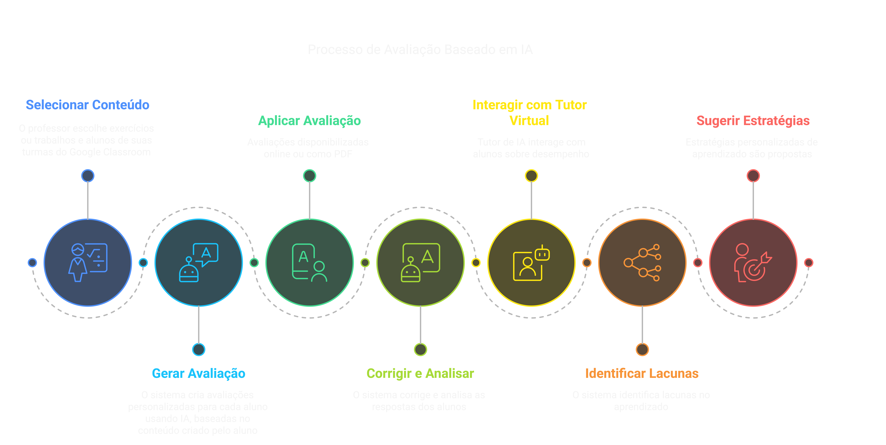

# AuraIA

## Descrição

O **AuraIA** - _Avaliação com Uso de Recursos de Aprendizagem mediados por
Inteligência Artificial_ é um sistema web para criação de avaliações personalizadas no contexto do ensino de programação e outras disciplinas técnicas. Ele utiliza a infraestrutura do **Google Classroom** para gerenciar turmas, alunos e trabalhos, permitindo que professores gerem avaliações de forma automatizada com suporte a IA generativa.

O sistema permite que professores selecionem exercícios (*coursework*) e alunos diretamente do **Google Classroom** e, a partir disso, gerem avaliações personalizadas online com correção e análise de resultados individuais de cada aluno. 

Um tutor virtual (chatbot com IA) é disponibilizado para cada aluno. Sua função é interagir com o aluno para analisar os resultados, comentar e tirar dúvidas do aluno em relação ao seu desempenho na avaliação. Com isso, o sistema pode verificar lacunas no aprendizado do aluno e propor estratégias para reforçar os conceitos não assimilados, sugerindo materiais complementares, exercícios personalizados e revisões adaptativas, visando a uma aprendizagem mais eficaz e individualizada. A atividade do tutor virtual pode ser totalmente autônoma ou supervisionada pelo professor.


As avaliações tambem podem ser exportadas em formato pdf, para serem impressas fisicamente, caso o professor opte por aplicá-las em sala de aula sem uso de computadores.

---
## Funcionalidades

- **Integração com Google Classroom:**
  - Listagem de cursos, alunos e exercícios disponíveis.
  - Seleção de alunos e exercícios para compor avaliações.

- **Criação de Avaliações:**
  - Interface para seleção de exercícios e alunos.
  - Definição de número de questões e data da prova.
  - Geração de avaliações individuais para cada aluno selecionado.

- **Geração de PDFs:**
  - Utilização da biblioteca ReportLab para gerar provas personalizadas em PDF.

- **Autenticação via Google:**
  - Login utilizando OAuth2 para autenticação com o Google.

- **Otimização do Carregamento de Dados:**
  - Armazena dados localmente para reduzir chamadas à API do Google.
  - Atualizações automáticas ou manuais a cada 5 minutos.

---
## Fluxo de Utilização do AuraIA

1. Configuração Inicial
- O professor acessa o sistema AuraIA.
- O sistema se integra ao Google Classroom para obter turmas, alunos e exercícios (*coursework*).

2. Seleção de Conteúdo
- O professor seleciona os exercícios disponíveis no Google Classroom.
- O professor escolhe os alunos que participarão da avaliação.

3. Geração da Avaliação
- O sistema gera automaticamente uma avaliação personalizada, utilizando IA generativa para criar questões baseadas nos exercícios selecionados.

4. Aplicação da Avaliação
- A avaliação pode ser disponibilizada online para os alunos realizarem dentro do sistema.
- Alternativamente, o professor pode exportar a avaliação em PDF para aplicação impressa em sala de aula.

5. Correção e Análise de Resultados
- O sistema corrige automaticamente as respostas enviadas pelos alunos.
- Os resultados individuais de cada aluno são analisados pelo sistema.

6. Interação com o Tutor Virtual
- Um tutor virtual baseado em IA é disponibilizado para cada aluno.
- O tutor interage com o aluno para analisar o desempenho, comentar sobre os resultados e responder dúvidas.
- O tutor pode operar de forma autônoma ou sob supervisão do professor.

7. Identificação de Lacunas e Reforço da Aprendizagem
- O sistema identifica lacunas no aprendizado do aluno.
- Estratégias personalizadas são sugeridas, incluindo:
  - Materiais complementares.
  - Exercícios personalizados.
  - Revisões adaptativas.

8. Acompanhamento e Ajustes
- O professor pode revisar os resultados e ajustar as estratégias de ensino conforme necessário.
- O ciclo pode ser repetido para melhorar continuamente a aprendizagem do aluno.




---
## Tecnologias Utilizadas

- **Backend:** FastAPI (Python)
- **Frontend:** Vue.js + Vite + TailwindCSS (com DaisyUI)
- **APIs do Google Utilizadas:**
  - **Google Classroom API** (Cursos, Trabalhos, Alunos)
  - **Google Drive API** (Acesso a anexos de submissões)
- **Gerenciamento de Dependências:** Poetry (backend) e npm (frontend)
- **Geração de PDFs:** ReportLab
- **Controle de Versão:** Git e GitHub

---
## Estrutura de Diretórios

Abaixo está a estrutura do projeto, com comentários explicando os diretórios e arquivos principais:

```
provaia/
├── backend/                     # Diretório do backend (FastAPI)
│   ├── poetry.lock               # Arquivo de lock do Poetry (dependências)
│   ├── pyproject.toml            # Configuração do projeto Poetry
│   ├── src/
│   │   ├── provaia/              # Código-fonte do backend
│   │   │   ├── api/              # Endpoints da API FastAPI
│   │   │   ├── services/         # Lógica de integração com Google APIs e geração de PDFs
│   │   │   ├── models/           # Modelos de dados (se aplicável)
│   │   │   ├── schemas/          # Definições Pydantic para validação de dados
│   │   │   ├── utils/            # Módulos utilitários
│   │   │   ├── main.py           # Arquivo principal para iniciar o servidor FastAPI
│   │   ├── tests/                # Testes automatizados do backend
│   ├── .env                      # Variáveis de ambiente (chaves de API, configurações)
│   ├── README.md                 # Documentação do backend
│
├── frontend/                    # Diretório do frontend (Vue.js)
│   ├── src/
│   │   ├── assets/              # Arquivos estáticos (imagens, ícones, etc.)
│   │   ├── components/          # Componentes Vue reutilizáveis
│   │   ├── views/               # Páginas principais do sistema
│   │   │   ├── Login.vue        # Página de login via Google
│   │   │   ├── ProfessorDashboard.vue  # Dashboard do professor
│   │   │   ├── TurmaDashboard.vue      # Painel de controle da turma
│   │   │   ├── EvaluationCreate.vue    # Página para criar avaliações
│   │   │   ├── EvaluationResult.vue    # Página para visualizar avaliações
│   │   ├── router/              # Configuração das rotas do Vue
│   │   ├── main.ts              # Arquivo principal do frontend
│   │   ├── index.css            # Estilos globais do projeto
│   ├── tailwind.config.ts       # Configuração do TailwindCSS
│   ├── package.json             # Dependências do frontend (npm)
│   ├── README.md                # Documentação do frontend
│
├── scripts/                     # Scripts auxiliares
│   ├── run_dev.sh               # Script para iniciar backend e frontend automaticamente
│
├── .gitignore                    # Arquivos e pastas ignoradas pelo Git
├── README.md                      # Documentação principal do projeto
```

---
## Instalação e Configuração

### Pré-requisitos

- Python 3.12+
- [Poetry](https://python-poetry.org/) para gerenciar dependências do backend
- Node.js + npm para gerenciar dependências do frontend
- Conta Google com acesso ao Google Classroom e Google Drive API

### Passos para Instalação

1. **Clone o Repositório**
   ```bash
   git clone git@github.com:rodacki/provaia.git
   cd provaia
   ```

2. **Configuração do Backend**
   ```bash
   cd backend
   poetry install
   ```
   - Crie um arquivo `.env` dentro de `backend/` e configure suas chaves de API do Google.
   - Inicie o backend:
     ```bash
     poetry run uvicorn src.provaia.main:app --reload
     ```

3. **Configuração do Frontend**
   ```bash
   cd frontend
   npm install
   npm run dev
   ```

---
## Desenvolvimento

### Comandos úteis

- **Executar backend:**
  ```bash
  poetry run uvicorn src.provaia.main:app --reload
  ```
- **Executar frontend:**
  ```bash
  npm run dev
  ```

---
## Versões do Sistema

- **0.1.0** - Versão inicial
  - Autenticação via Google OAuth2
  - Listagem de cursos e trabalhos
  
- **0.2.0** - Melhorias implementadas
  - Visualização/remoção de avaliações já criadas
  - Melhorias na interface do usuário
  - Otimização do processo de geração de provas

- **0.3.0** - Melhorias planejadas
  - Edição de avaliações já criadas
  - salvar avaliações em PDF
  - criar link para prova online para aluno
  - criar modulo para prova online


---
## Contribuição

Se deseja contribuir para o projeto:
- Faça um **fork** do repositório.
- Crie uma **branch** para suas alterações.
- Envie um **Pull Request** com as mudanças e uma descrição detalhada.

---
## Licença

Este projeto está licenciado sob a [MIT License](LICENSE).

---
## Contato
- Prof. Paulo César Rodacki Gomes – rodacki@gmail.com
- [Perfil no GitHub](https://github.com/rodacki)


